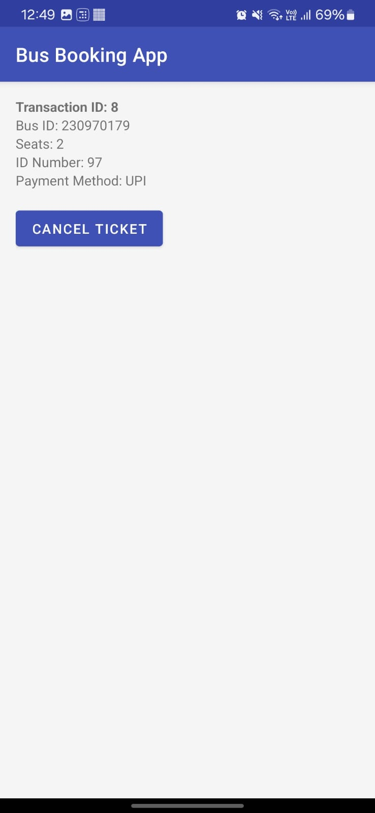
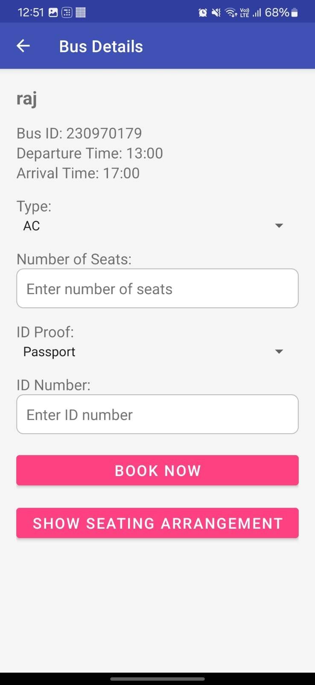

# Bus Booking App

**The Bus Booking App** is a mobile application designed to streamline the process of booking bus tickets. It offers users a convenient platform to search for bus routes, view schedules, and purchase tickets directly from their smartphones. The app aims to enhance the travel experience by providing a user-friendly interface and efficient booking system.

---

## Features

- **User Registration and Authentication**: Allows users to create accounts, log in, and manage their profiles.
- **Bus Route Search**: Enables users to search for available bus routes based on their source and destination.
- **Schedule Display**: Provides detailed bus schedules, including departure times, arrival times, and bus types.
- **Ticket Booking**: Allows users to select seats and book tickets for their chosen routes.
- **Payment Integration**: Supports secure payment methods for ticket purchases.
- **Booking History**: Enables users to view and manage their past bookings.
- **Notifications**: Sends updates and reminders about upcoming trips and promotions.

---

---

## App Screenshots  

### 1. User login Screen  
  

### 2. Search Bus Results  
  

### 3. App Setting 
! [App Setting ](IMG-20250119-WA0010.jpg)  

### 4. Previous Transactions  
  

### 5. Transactions ID
  

### 6. User Info
 

### 7. Bus Availablety 
 

### 8. Bus Details 
 

### 9. Payment Page
 


### 10. Successfull! 


---

## Tech Stack

- **Languages**: Java (Android development).
- **Frameworks and Libraries**:
  - Android SDK for building the mobile application.
  - Retrofit for network operations.
  - Room Database for local data storage.
  - Firebase for user authentication and real-time database services.
- **Tools**:
  - Android Studio as the Integrated Development Environment (IDE).
  - Git for version control.

---

## How to Run

1. **Clone the Repository**:
   ```bash
   git clone https://github.com/kashifumair125/Bus_Booking_App.git
   ```

2. **Open in Android Studio**:
   - Launch Android Studio.
   - Select "Open an existing project" and navigate to the cloned repository folder.

3. **Sync Gradle**:
   - Click on "Sync Now" in the bar that appears at the top to sync the project with Gradle.

4. **Configure Firebase**:
   - Set up Firebase in your project by following the [Firebase setup guide](https://firebase.google.com/docs/android/setup).
   - Add your `google-services.json` file to the `app/` directory.

5. **Run the Application**:
   - Connect an Android device or start an emulator.
   - Click on the "Run" button (the green arrow) in Android Studio.

6. **Test the Application**:
   - Once the app is installed on your device, open it to test its functionality.

---
